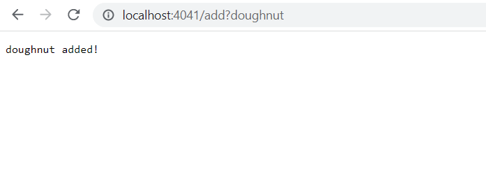

#  Part 1 - Search Engine

### The code for SearchEngine.java: 
```
import java.io.IOException;
import java.net.URI;
import java.util.ArrayList;

class Handler implements URLHandler {
    ArrayList<String> terms = new ArrayList<String>();
    public String handleRequest(URI url) {
        if (url.getPath().equals( "/")) 
            return terms.toString();
        else {
            String[] parameters = url.getQuery().split("=");
            if (url.getPath().equals("/add")) {
                terms.add(parameters[0]);
                return String.format("%s added!", parameters[0]);
            }
            else if(url.getPath().equals("/search")) {
                String foundStrings = "";
                for( String t: terms)
                    if (t.contains(parameters[0]))
                        foundStrings = foundStrings + t + ", ";
                return foundStrings;
            }
            return "404 not found!";
        }
    }
}

class SearchEngine {
    public static void main(String[] args) throws IOException {
        if(args.length == 0){
            System.out.println("Missing port number! Try any number between 1024 to 49151");
            return;
        }
        int port = Integer.parseInt(args[0]);
        Server.start(port, new Handler());
    }
}
```
### Screenshots of SearchEngine.java's functionality

1) Add function
* This first screenshot calls the "add" function append terms to the end of the list of terms in the search engine.
* Anything taken to the right of the first `/` (the path) will be taken as arguments. If the first argument is `/add` , it will call the add method and taken anything right of the first `?` (the query) as the term to be added to the list of terms. As you can see, "doughnut" is added with command `/add?doughnut`.
*
2) List function
