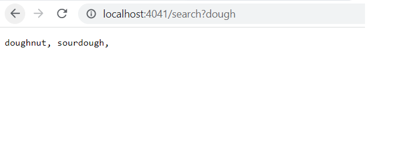

#  Part 1 - Search Engine

### The code for SearchEngine.java: 
```
import java.io.IOException;
import java.net.URI;
import java.util.ArrayList;

class Handler implements URLHandler {
    ArrayList<String> terms = new ArrayList<String>();
    public String handleRequest(URI url) {
        if (url.getPath().equals( "/")) 
            return terms.toString();
        else {
            String[] parameters = url.getQuery().split("=");
            if (url.getPath().equals("/add")) {
                terms.add(parameters[0]);
                return String.format("%s added!", parameters[0]);
            }
            else if(url.getPath().equals("/search")) {
                String foundStrings = "";
                for( String t: terms)
                    if (t.contains(parameters[0]))
                        foundStrings = foundStrings + t + ", ";
                return foundStrings;
            }
            return "404 not found!";
        }
    }
}

class SearchEngine {
    public static void main(String[] args) throws IOException {
        if(args.length == 0){
            System.out.println("Missing port number! Try any number between 1024 to 49151");
            return;
        }
        int port = Integer.parseInt(args[0]);
        Server.start(port, new Handler());
    }
}
```
### Screenshots of SearchEngine.java's functionality

1) Add function
* This first screenshot calls the "add" function append terms to the end of the list of terms in the search engine.
* Anything taken to the right of the first `/` (the path) will be taken as arguments. If the first argument is `/add` , it will call the add method and taken anything right of the first `?` (the query) as the term to be added to the list of terms. As you can see, "doughnut" is added with command `/add?doughnut`.
* The only persistent value in the class is the ArrayList of Strings, `terms`. This is the only function that interacts with it, by adding to the end of the list.


2) List function
* This second screenshot shows the "list" function, which shows the current terms in the search engine in sequence. This is the result after 4 more "add"s were done after adding doughnut.
* If there is no arguments provided (i.e. the path is just `/`), then the program while show the toString of the list of terms.
* This function doesn't change any of the values, it only displays them.


3) Search function
* The third screenshot shows the "search" function, which returns any term in the search engine that includes a key term.
* If the first argument in the path is `/search`, it will take the first argument in the query as the search parameter. "dough" appears in both doughnut and sourdough, so the two appear in sequence as result.
* This function doesn't change the values stored in `terms`.

# Part 2 - Bugs
## filter() in ListExamples.java
### Failure-inducing Input
```
@Test
    public void testFilter() {
        List<String> testList = new ArrayList<>();
        testList.add("Apple");
        testList.add("Peach");
        List<String> checkList = ListExamples.filter(testList, new DogChecker());
        assertEquals(testList, checkList);
    }
```
*DogChecker checks for "dog"*

### The Sympton


filter() ends up reversing the order of the list.

### The Bug

The code-fix is to change `result.add(0,s)` to `result.add(s)`


### Connection between the sympton and bug

So the bug causes all lists returned by filter() to be reversed in order. This is due to the fact that is it iterates through the loop front to end, but always adds to the first index. This means the first element will be added to the front, but by the time it loops through the list it will be at the end of the list. This is what happens for the list {"Apple", "Peach"}, but will also haappen to any list that isn't "mirrored" (for example, {}, {"Cat"}, or {"Cat","Bread","Cat"}).

## reversed() in ArrayExamples.java

### Failure-inducing input


### The Sympton

The output was that the element found at index [2] was 13, not 12.

### The Bug


### Connection between the sympton and bug

The problem was that before the code-fix, it was reversing correctly. However, it was assigning to arr, and returning newArray. Instead, it should modify newArray if it's returning newArray.